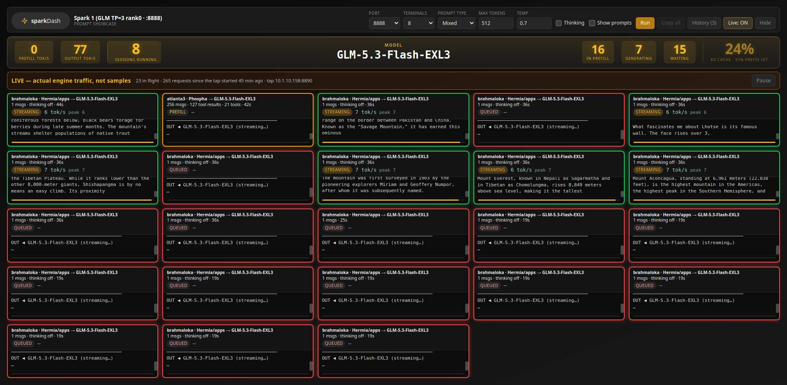

# glm-tap — see what your engine is *actually* being asked



**No engine changes, no restart, no logging flags** — the tap is a transparent relay beside the engine.

A tiny, dependency-free request tap for a vLLM (or any OpenAI-compatible) engine. It powers the
**Live requests** view in sparkDash's Prompt Showcase: real requests from every client, IN and OUT,
streaming, with prefill/queue/generation phases — instead of sample prompts.

## How it works

* `glm-tap.py` is a **byte-level TCP relay**: `0.0.0.0:8889 → 127.0.0.1:8888`. Every byte is forwarded
  unchanged in both directions (no header rewriting, no stream buffering), so HTTP/SSE semantics stay
  the engine's own. Keep-alive and pipelining are handled.
* On the side it parses each request (head + `Content-Length` body) and, for `POST /v1/chat/completions`,
  records: model, message count, tool-result count, tools, thinking/effort flags, prompt size, the last
  user message, and the conversation the request carried (last 80 requests, per-message cap). Then it
  decodes a *copy* of the response (chunked or content-length), parses SSE deltas (`content`,
  `reasoning`/`reasoning_content`, tool calls), and tracks first-token time, chunk count, finish reason,
  usage, tok/s.
* A second listener serves JSON on `:8890`: `GET /recent?n=&tail=` (in-flight + ring buffer of 300),
  `GET /req/<id>` (one request with its transcript), `GET /health`.
* Traffic reaches the relay through an **iptables REDIRECT** added by the systemd unit's
  `ExecStartPost` and removed by `ExecStopPost`. If the tap dies, the rule goes with it — clients hit the
  engine directly. Loopback clients bypass the tap.

Overhead: one local hop; Python asyncio; negligible CPU at fleet load (12 agents, MB-sized prompts).
Memory: ring buffer 300 summaries + 80 transcripts (≈ tens of MB worst case). No engine flags, no
restart, no `--enable-log-requests` (which in current vLLM logs prompt text only at DEBUG anyway).

## Install (on the engine host)

```bash
sudo install -d /opt/glm-tap && sudo install -m 755 glm-tap.py /opt/glm-tap/
sudo install -m 644 glm-tap.service.example /etc/systemd/system/glm-tap.service
# edit TAP_IFACES (your LAN NIC, tailscale0, ...) and ports if needed
sudo systemctl daemon-reload && sudo systemctl enable --now glm-tap
curl -s http://127.0.0.1:8890/health   # ok
```

Verify the relay is transparent before trusting it: run one streamed and one non-streamed completion
through `:8888` from another host and diff against a direct call (they are byte-identical).

## sparkDash side

* `sparks.json`: optional `"tapPort": 8890` per Spark (default 8890; env `SPARKDASH_TAP_PORT`).
* `config/live-clients.json` (optional): `{ "10.0.0.5": "workstation · alice" }` to label client IPs.
* Showcase page → **Live requests** button: real requests as terminals (IN + streamed OUT), sized by
  the terminal-count control and growing to show every in-flight session; click a terminal for the
  full inquiry (history + current answer), Back/Esc returns; engine stats in the model header
  (prefill/output tok/s, sessions running, in-prefill / generating / waiting, KV cache).

## Notes

* Phases: the tap knows *no token yet* vs *streaming*; vLLM's `num_requests_waiting` says how many of
  the no-token requests are still **queued** (red) rather than in **prefill** (yellow).
* The tap shows conversations in the clear on whatever screen runs sparkDash — that is the point,
  but keep the `:8890` port on a trusted network.
